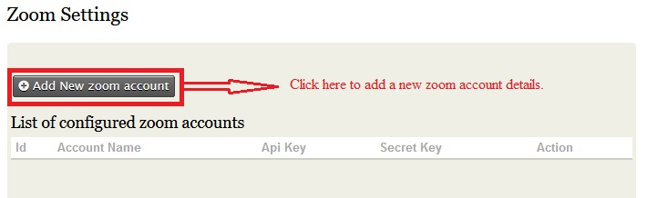
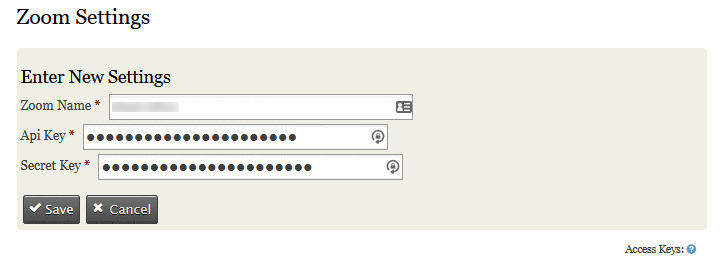
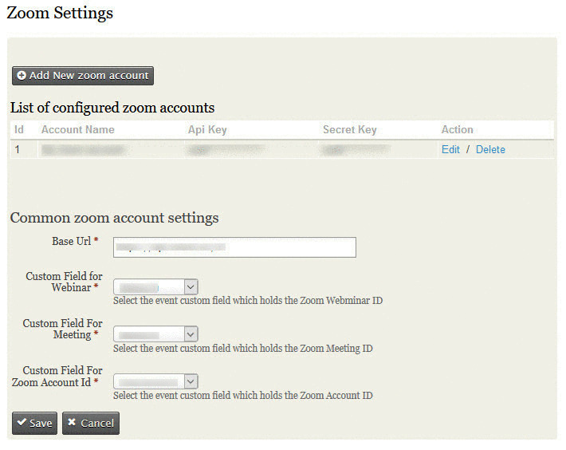
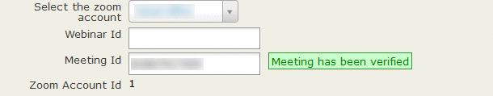

# ncn-civi-zoom
Civirules Conditions/Actions that talk with Zoom developed for NCN.

# What it does
This extension will connect CiviEvents with Zoom, allowing registrations for zoom events to be captured in your CiviCRM install via your website. This has a multitude of benefits, including GDPR compliance, using Zooms workflow, removing the need to manually export/import as well as being able to manage events in the same way you would any other CiviCRM events.

## Requirements

* PHP v7.0+
* CiviCRM 5.0+
* CiviRules extension

## Installation

A helper Youtube installation video can be found [here](https://youtu.be/6rta9V3J7yc)

Follow the Setup guide below, the key steps are;

* Create a connector in Zoom (JWT App)
* Create relevant custom fields in CiviCRM for Events to hold zoom information
* Install the CiviCRM Zoom Extension. More details [here](https://docs.civicrm.org/sysadmin/en/latest/customize/extensions/#installing-a-new-extension) about installing extensions in CiviCRM.
* Connect CiviCRM to Zoom via settings

Following this you will then have the option, per event, to pass information over to zoom on registration of participants, either online or offline.

All of the setup and useage steps are outlined below.

## Setup
### Sign into Zoom and Create a JWT App

The JWT App within your Zoom account will allow you to connect CiviCRM to zoom, so that it can pass over participant information.

* Create a JWT app in your zoom account's [zoom market place](https://marketplace.zoom.us/develop/create) page using the instructions given in [the guide](https://marketplace.zoom.us/docs/guides/build/jwt-app).
* Keep a copy of the **API Key** and **API Secret Key** credentials, you'll need them to enter them into the CiviCRM Zoom settings

### Sign into CiviCRM and setup custom fields for Zoom
Create custom fields against the Event entity (you can select which types of events Zoom fields applicable too or leave blank for all events).
Also note we would recommend turning off the public setting on the custom field group as you probably dont want the IDs being exposed publicly on information pages.
The fields needed are
* Zoom Account ID. As the extension supports multiple zoom accounts in a single installation this field will store which zoom account the meeting or webinar is for.
* Zoom Webinar ID. Will hold Zoom Webinar IDs
* Zoom Meeting ID. Will hold the Zoom Meeting ID.

### Sign into CiviCRM and install the CiviCRM Zoom extension

More details [here](https://docs.civicrm.org/sysadmin/en/latest/customize/extensions/#installing-a-new-extension) about installing extensions in CiviCRM.

### Sign into CiviCRM and configure the Zoom settings
* Install the extension
* Navigate  to the zoom settings as **Events >> Zoom Settings**. 
* Create an entry for the zoom account (Note that the extension supports multiple Accounts)

* On clicking the **Add New zoom account** button you'll be taken to a page where you need to enter the details of the new zoom account. Note the name is purely an internal identifier, in the case of multiple zoom accounts it can be use to easily differentiate the options.

* Along with that you also need to enter the 'Base url' in the same settings page. Note the Base URL should be set to https://api.zoom.us/v2 if the extension doesn't automatically set it.

### Configure CiviRules to send participant information to Zoom
In order to pass the details over to Zoom the extension creates a new rule action "Add Participant to Zoom". The action uses the zoom details set on the event the participant has registered for and uses that to determine which event, if any, to register them into Zoom. What you will need to do is determine how long a delay, if any, you want before the participant is pushed to zoom. 

Once you've decided this you can create a new CiviRule as per the screen shot.

## Enabling the integration for a CiviEvent
### Configure the CiviEvent
* Once the settings page has been created then you can see the configured zoom account ids list as drop down box just above the Webinar Id field , whenever you Add/Edit an event as below.
* Once you've selected a zoom account and entered a Webinar Id / Meeting Id your webinar/meeting id will be verified with the selected zoom account along with a message next to the text box as below.

